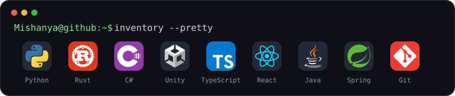

<a id="mishanya-os"></a>

<div align="center">

<a href="#mishanya-os"></a>

</div>

<br>

<a id="inventory"></a>
<details open>
<summary><code>Mishanya@github:~$ inventory --pretty</code></summary>

<br>

<div align="center">

<a href="#inventory"></a>

</div>

</details>

<br>

<a id="activity"></a>
<details open>
<summary><code>Mishanya@github:~$ activity --last 7d</code></summary>

<br>

<div align="center">

<a href="#activity"></a>

</div>

</details>

<br>

<a id="quests"></a>
<details open>
<summary><code>Mishanya@github:~$ ls ./quests</code></summary>

<br>

```text
drwxr-xr-x  titanic-survival-prediction/
drwx------  ???/
drwx------  ???/

2 directories are still locked.
probably for everyone's safety.
```

[`> open ./quests/titanic-survival-prediction`](https://github.com/MishanyAG/titanic-survival-prediction)

</details>

<br>

<details>
<summary><code>Mishanya@github:~$ cat classified.txt</code></summary>

<br>

```text
access granted.

current objective:
  build strange little things
  learn stuff
  survive "one last commit"

warning:
  sleep schedule may be unstable.
```

</details>

<br>

<details>
<summary><code>Mishanya@github:~$ help</code></summary>

<br>

```text
whoami      — definitely Mishanya
inventory   — things I use to break things
activity    — weekly public GitHub commits
quests      — projects worth showing
exit        — nice try
```

</details>

<br>

<div align="center">

`after 4AM // one last commit`

</div>
