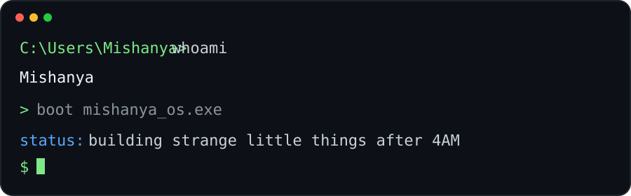

 

<code>C:\Users\Mishanya&gt; inventory --pretty</code>

 

 

<code>C:\Users\Mishanya&gt; activity --last 7d</code>

 

 

<code>C:\Users\Mishanya&gt; ls ./quests</code>

 

 

<a href="https://github.com/MishanyAG/titanic-survival-prediction"><code>C:\Users\Mishanya&gt; start .\quests\titanic-survival-prediction</code></a>

 

<code>C:\Users\Mishanya&gt; cat classified.txt</code>

 

 

<code>C:\Users\Mishanya&gt; help</code>

 

 

<code>after 4AM // one last commit</code>

